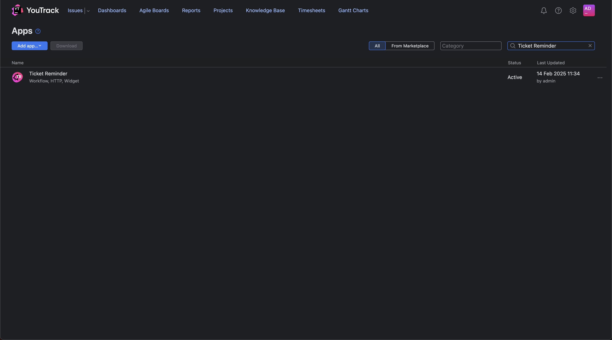
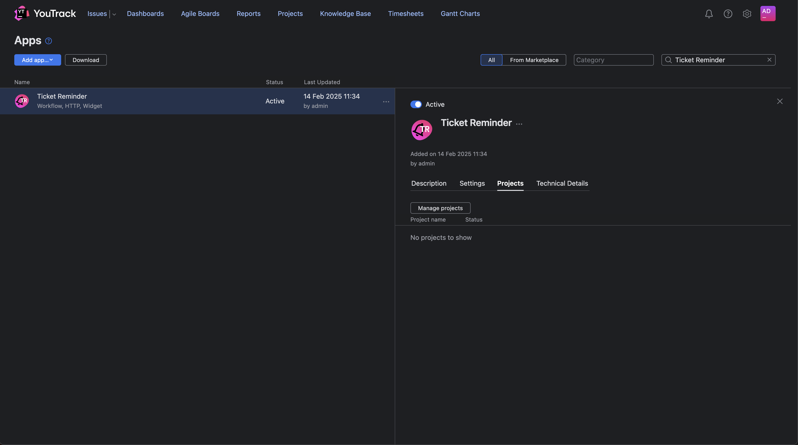

#  YouTrack Issue-Reminder

A simple tool to set up reminders for existing issues in YouTrack.

---

# **tnty20 | YouTrack Apps and Extensions**

We specialize in developing custom YouTrack apps and extensions tailored specifically to your needs.

With our expertise and close collaboration with **JetBrains**, we ensure seamless integration and functionality.

👉 Visit our **[Website](https://twenty20.de/)** for more information and to explore our services.

👉 Looking for other extensions?  
Check out our offerings in the **[JetBrains Marketplace](https://plugins.jetbrains.com/youtrack_app)**.

---

## 📌 Setup Guide

Follow these steps to install and configure the Issue Reminder App in YouTrack.

---

### 🛠 Step 1: Install the Issue Reminder App
1. Upload the **Issue Reminder App** to your YouTrack instance.
2. Open YouTrack and navigate to the **Apps** window.
3. Search for **Issue Reminder** and select it.

---

### 📌 Step 2: Assign the App to Projects
1. Click on the **Issue Reminder App**.
2. Go to the **Projects** tab.
3. Click **Manage Projects** and add the app to the necessary projects.

---

### ✅ Setup Complete!
Your YouTrack Issue Reminder App is now configured and ready to use. 🎉

---
