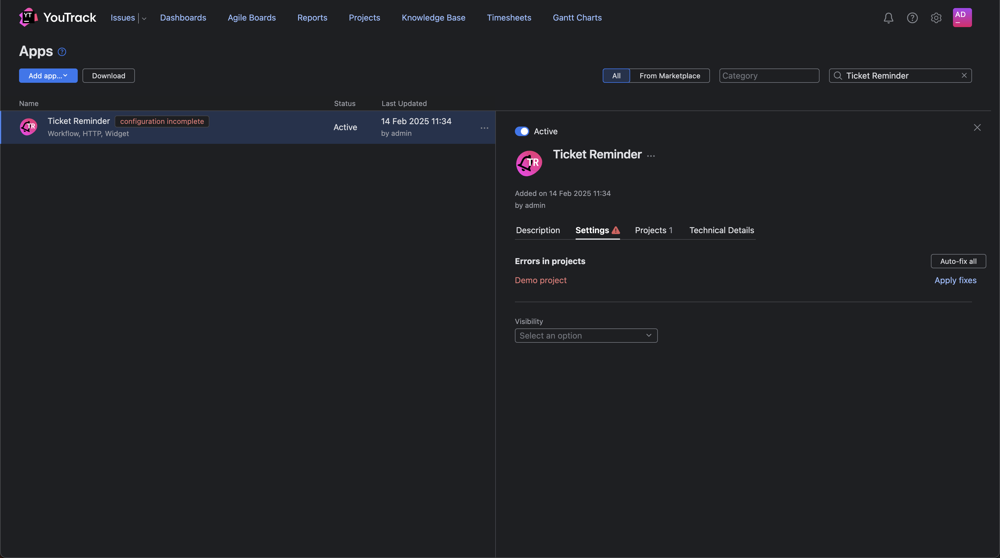
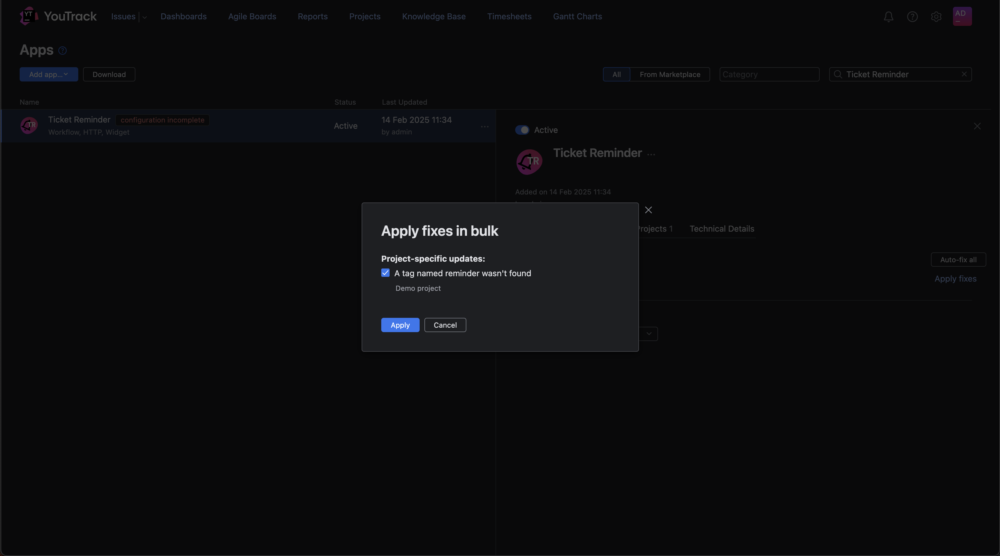
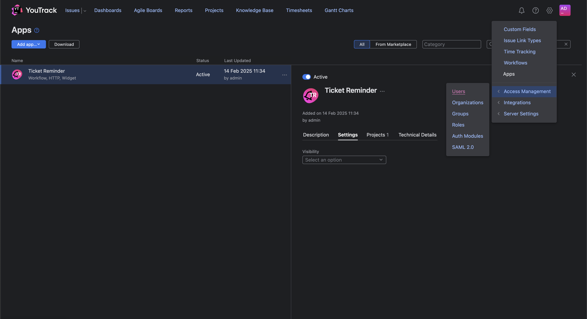
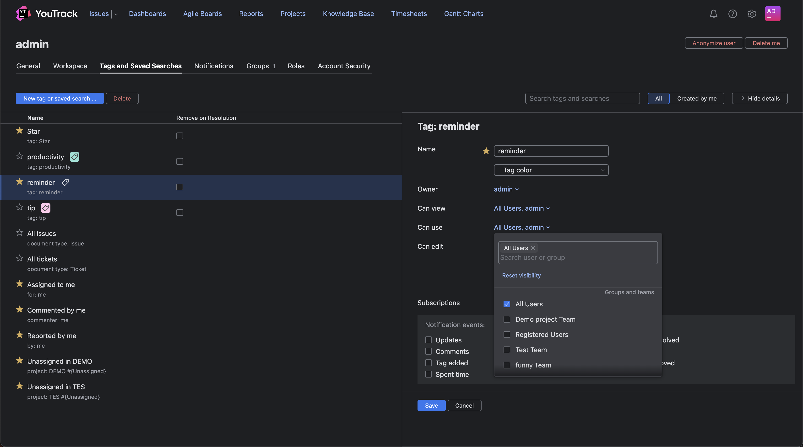

# YouTrack Ticket-Reminder

A simple tool to set up reminders for existing issues in YouTrack.

## 📌 Setup Guide

Follow these steps to install and configure the Ticket Reminder App in YouTrack.

---

### 🛠 Step 1: Install the Ticket Reminder App
1. Upload the **Ticket Reminder App** to your YouTrack instance.
2. Open YouTrack and navigate to the **Apps** window.
3. Search for **Ticket Reminder** and select it.

---

### 📌 Step 2: Assign the App to Projects
1. Click on the **Ticket Reminder App**.
2. Go to the **Projects** tab.
3. Click **Manage Projects** and add the app to the necessary projects.

---

### ⚙️ Step 3: Apply Auto-Fix
1. Click on the **Settings** tab.
2. Select **Auto-fix all**.

---

### 🚀 Step 4: Handle Missing Reminder Tag
1. Locate **"A tag named reminder wasn't found"** in the auto-fix results.
2. Click **Apply** to resolve the issue.

---

### 🔑 Step 5: Configure User Permissions
1. Click on the **Settings Icon (Gear) 🛠**.
2. Navigate to **Access Management → Users**.

---

### 👥 Step 6: Assign Reminder Tag Permissions
1. Select a user and open the **Tags and Saved Searches** tab.
2. On the right, click **All**, then search for **reminder**.
3. Click on the **reminder** tag and set **Can use → All Users**.
4. Save the changes.

---

✅ **Setup Complete!** Your YouTrack Ticket Reminder App is now configured and ready to use.
